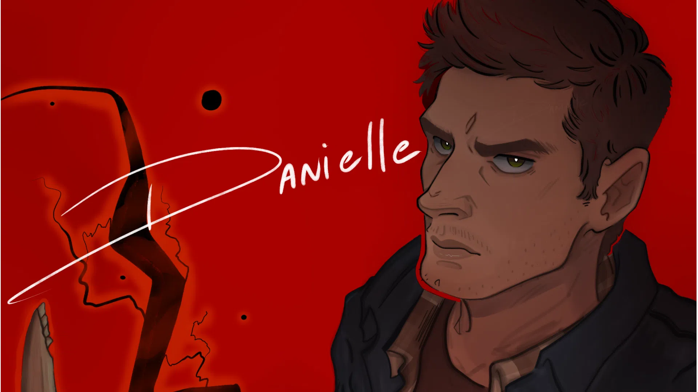

# Portfolio Danielle Spantosicus

Site oficial de portfólio e comissões da artista digital [Danielle Spantosicus](https://vgen.co/Spantosicus_).



## Sobre

Projeto criado para apresentar o trabalho e os serviços de comissão da artista. Planejado e desenvolvido por um homem 100% apaixonado.

### Páginas

- **Home**: ilustrações selecionadas, serviços de comissão, processo de trabalho, avaliações de clientes, FAQ e link para solicitação via VGen.
- **About**: história e apresentação da artista.
- **Portfolio**: galeria de trabalhos.

## Internacionalização

O projeto foi desenvolvido com suporte a múltiplos idiomas desde o início. Idiomas disponíveis atualmente:

- `pt-br` — Português (Brasil)
- `en` — English (United States)

Comportamento de rotas:

- `/` redireciona com `302` para `/<idioma>/` com base no header `Accept-Language`.
- As páginas ficam sob prefixo de idioma (exemplo: `/en/...` e `/pt-br/...`).

## Stack

- Astro 6
- Tailwind CSS 4 (via `@tailwindcss/vite`)
- TypeScript
- `@astrojs/mdx`
- `@astrojs/sitemap`
- `@astrojs/rss`
- `@astrojs/vercel`

## Requisitos

- Node.js `>= 22.12.0`
- npm

## Como rodar localmente

```bash
npm install
npm run dev
```


## Licença e uso

O código-fonte deste repositório é disponibilizado apenas para fins não comerciais.

As imagens e demais ativos visuais presentes em `src/assets` são de autoria exclusiva de [Danielle Spantosicus](https://vgen.co/Spantosicus_). Nenhum uso, reprodução ou redistribuição desses arquivos é permitido sem autorização expressa da artista.
