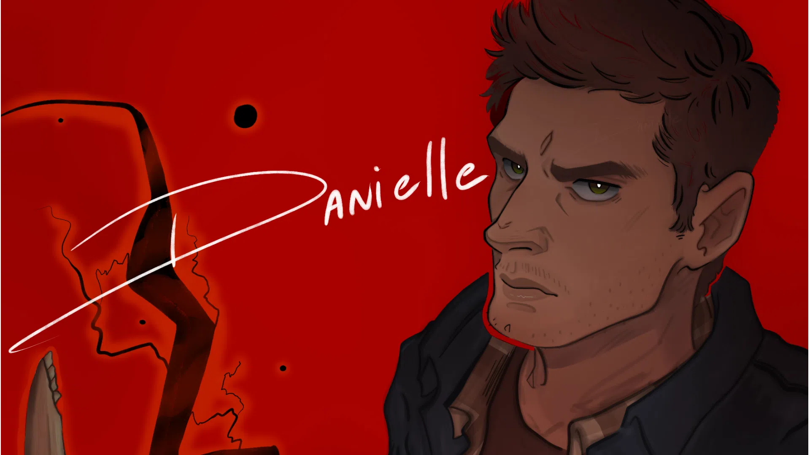

# Portfolio Danielle Spantosicus

Site oficial de portfólio e comissões da artista digital [Danielle Spantosicus](https://vgen.co/Spantosicus_).



## Sobre

Projeto criado para apresentar o trabalho e os serviços de comissão da artista. Planejado e desenvolvido por um homem 100% apaixonado.

### Páginas

- **Home**: ilustrações selecionadas, serviços de comissão, processo de trabalho, avaliações de clientes, FAQ e link para solicitação via VGen.
- **About**: história e apresentação da artista.
- **Portfolio**: galeria de trabalhos.
- **404**: página de erro traduzida, com o caminho de volta para a home e para o portfólio.

## Internacionalização

O projeto foi desenvolvido com suporte a múltiplos idiomas desde o início. Idiomas disponíveis atualmente:

- `en` — English (United States)
- `pt-br` — Português (Brasil)
- `es` — Español

Comportamento de rotas:

- `/` redireciona com `302` para `/<idioma>/` com base no header `Accept-Language`.
- As páginas ficam sob prefixo de idioma (exemplo: `/en/...`, `/pt-br/...` e `/es/...`).
- Idiomas não previstos caem no idioma padrão (`en`), que também é o `x-default` do `hreflang`.

Toda a cópia do site — inclusive `aria-label` e textos de leitor de tela — vive em `src/i18n/`.
Nada de texto voltado ao usuário escrito direto em componente.

## Stack

- Astro 6 (`output: 'server'` com páginas pré-renderizadas)
- Tailwind CSS 4 (via `@tailwindcss/vite`, sem `tailwind.config`)
- TypeScript (`astro/tsconfigs/strict`)
- `@astrojs/mdx`
- `@astrojs/sitemap`
- `@astrojs/vercel`
- `sharp` + `astro:assets` para otimização de imagens

## Requisitos

- Node.js `>= 22.12.0`
- npm

## Como rodar localmente

```bash
npm install
npm run dev
```

## Scripts

| Comando | O que faz |
|---|---|
| `npm run dev` | Servidor de desenvolvimento |
| `npm run build` | Build de produção |
| `npm run preview` | Serve o build localmente |
| `npm run typecheck` | `astro check` — deve ficar em 0 erros / 0 warnings / 0 hints |
| `npm run qa:visual` | QA visual e de acessibilidade em 390 / 768 / 1024 / 1440 (screenshots em `.qa/`) |
| `npm run qa:perf` | Tracing do Chrome com CPU estrangulada, para o custo das interações contínuas |

O `qa:visual` precisa de um servidor rodando em `npm run dev -- --port 4399` e usa o Chrome/Edge
já instalado no sistema. O `qa:perf` precisa de um `npm run build` antes.

## Documentação do projeto

- [CLAUDE.md](CLAUDE.md) — mapa das decisões técnicas e de conteúdo.
- [docs/REDESIGN.md](docs/REDESIGN.md) — plano de redesign e suas fases.
- [docs/BASELINE.md](docs/BASELINE.md) — métricas de performance medidas antes do redesign.

## Licença e uso

O código-fonte deste repositório é disponibilizado apenas para fins não comerciais
(`CC BY-NC-SA 4.0`).

As imagens e demais ativos visuais presentes em `src/assets` são de autoria exclusiva de [Danielle Spantosicus](https://vgen.co/Spantosicus_). Nenhum uso, reprodução ou redistribuição desses arquivos é permitido sem autorização expressa da artista.
